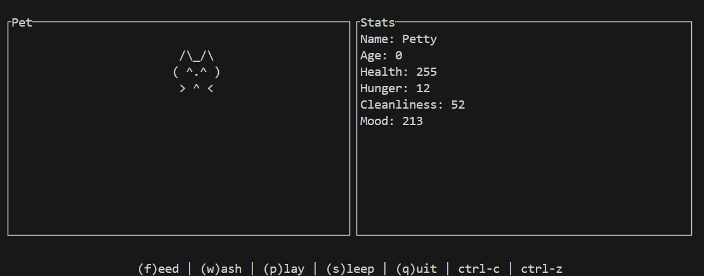

# Petty - 你的终端电子宠物 🦀

一个在终端里活蹦乱跳的 ASCII 宠物，让你在编码的间隙找到一丝乐趣和慰藉。



## ✨ 功能

- **互动养成**: 你可以喂食、洗澡、陪它玩耍，看着它成长。
- **状态模拟**: 宠物拥有健康、饥饿、心情、清洁度等多种状态，会随着时间流逝而变化。
- **睡眠系统**: 宠物可以进入睡眠状态，在睡眠中恢复健康。
- **成长机制**: 宠物会随时间增长年龄。
- **持久化**: 宠物的状态会自动保存在本地 (`~/.petty/state.json`)，下次打开时可以继续上次的进度。
- **遗弃机制**: 如果你连续 3 天不照顾你的宠物，它会离家出走。
- **开发者模式**: 输入 "debug" 可以进入开发者模式，用于测试不同的状态。
- **后台挂起支持**: 支持 Ctrl+Z 挂起和 fg 恢复，即使在后台挂起时游戏时间也会继续流逝。
- **纯文本 UI**: 基于 `ratatui` 构建的复古、轻量级终端界面。

## 🚀 安装与运行

### 环境要求

- [Rust](https://www.rust-lang.org/tools/install) (2024 Edition 或更高)

### 从源码构建

1. 克隆本仓库:

   ```bash
   git clone https://github.com/your-username/petty.git
   cd petty
   ```

2. 构建并运行:
   ```bash
   cargo run
   ```

## ⌨️ 如何使用

启动应用后，你可以使用以下按键与你的宠物互动:

- `f` - **喂食 (Feed)**: 降低饥饿度，恢复健康。
- `w` - **洗澡 (Wash)**: 恢复清洁度。
- `p` - **玩耍 (Play)**: 提升心情，但会消耗一些体力。
- `s` - **睡眠 (Sleep)**: 切换睡眠状态，睡眠中会缓慢恢复健康。
- `q` - **退出 (Quit)**: 保存状态并退出程序。
- `Ctrl+C` - **退出**: 保存状态并退出程序。
- `Ctrl+Z` - **挂起**: 将程序挂起到后台，使用 `fg` 命令可以恢复。

### 开发者模式

在程序运行时输入 "debug" 可以进入开发者模式，此时可以使用以下按键:

- `h` - 增加饥饿度
- `j` - 减少饥饿度
- `m` - 增加心情值
- `n` - 减少心情值
- `c` - 增加清洁度
- `v` - 减少清洁度
- `Esc` - 退出开发者模式

## 🛠️ 技术栈

- **核心语言**: [Rust](https://www.rust-lang.org/)
- **终端 UI**: [ratatui](https://ratatui.rs/)
- **异步处理**: [tokio](https://tokio.rs/)
- **序列化**: [serde](https://serde.rs/)

## 💡 灵感来源

本项目的设计灵感来源于经典的电子宠物游戏 [Tamagotchi](https://tamagotchi.com/)，旨在为命令行爱好者复刻这一怀旧体验。
